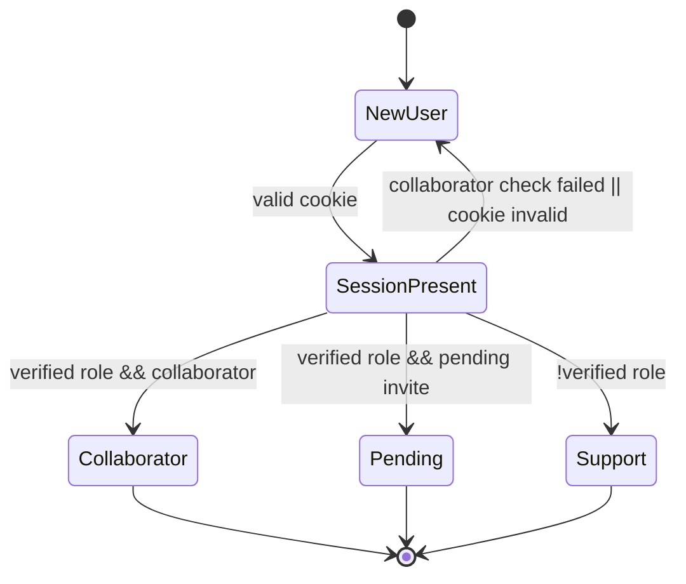

# Data Model: Returning User Experience

## Entities

### ReturningUserSession

| Field             | Type                               | Constraints                                                  | Notes                                                                 |
| ----------------- | ---------------------------------- | ------------------------------------------------------------ | --------------------------------------------------------------------- |
| `discordUsername` | branded `DiscordUsername` (string) | Required; case-sensitive username as provided by Discord API | Stored in signed cookie; used for personalization and role validation |
| `githubUsername`  | branded `GitHubUsername` (string)  | Required; must satisfy `assertValidGitHubUsername`           | Passed to GitHub collaborator check                                   |
| `signupDate`      | ISO8601 date string                | Required; formatted `YYYY-MM-DD`                             | Rendered as `Oct 25, 2025` via locale formatting                      |
| `expiresAt`       | Unix epoch millis                  | Required; TTL 90 days                                        | Used server-side to invalidate stale session                          |
| `signature`       | Base64url string                   | Required; appended when serializing                          | Ensures cookie tamper protection                                      |

### WelcomeDecision

| Field             | Type                                                             | Constraints                                        | Notes                                     |
| ----------------- | ---------------------------------------------------------------- | -------------------------------------------------- | ----------------------------------------- |
| `state`           | Union: `"collaborator" \| "pending" \| "new" \| "support"`       | Required                                           | Drives UI branch                          |
| `discordUsername` | Optional string                                                  | Present when state is `collaborator` or `pending`  | Personalization                           |
| `memberSince`     | Optional string                                                  | Localized date string                              | Displayed when `state === "collaborator"` |
| `cta`             | Object `{ label: string; href: string; openInNewTab?: boolean }` | Optional; required when `state === "collaborator"` | Provides navigation                       |
| `errorMessage`    | Optional string                                                  | Present when API failure or invalid session        | Maintains UX-005                          |

### ValidationResult

| Field                  | Type          | Constraints | Notes                                          |
| ---------------------- | ------------- | ----------- | ---------------------------------------------- |
| `hasVerifiedRole`      | boolean       | Required    | Derived from Discord bot API response          |
| `isCollaborator`       | boolean       | Required    | Derived from GitHub API via PAT                |
| `hasPendingInvitation` | boolean       | Required    | Derived from GitHub invitations list           |
| `apiErrors`            | Array<string> | Optional    | Populated when Discord or GitHub requests fail |

## Relationships & Flow

1. `ReturningUserSession` cookie is read on `signup` loader. If missing, proceed with existing multi-step flow.
2. When present, loader invokes Discord bot and GitHub verification, merging their outputs into a `ValidationResult`.
3. `ValidationResult` + cookie payload is mapped into a `WelcomeDecision` for the client:
   - `hasVerifiedRole && isCollaborator` → `state: "collaborator"`
   - `hasVerifiedRole && !isCollaborator && hasPendingInvitation` → `state: "pending"`
   - Otherwise → fall back to standard flow (`state: "new"` or route to support)
4. Client renders spinner while awaiting loader data; UI components consume `WelcomeDecision` to show final content.

## Validation Rules

- Cookie payload must be signed with server secret; signature mismatch invalidates session (Security-004).
- Session older than 90 days or missing required fields is treated as absent (FR-012, Security-006).
- Discord role verification requires the configured role id; absence redirects to support (Edge case #2).
- GitHub collaborator verification failure emits fallback error and resets to standard flow (FR-008, Edge case #4).

## State Transitions

